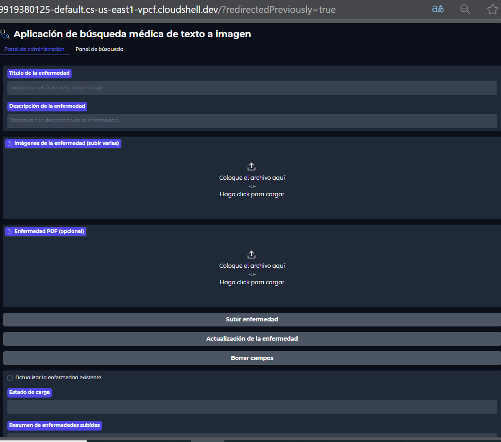
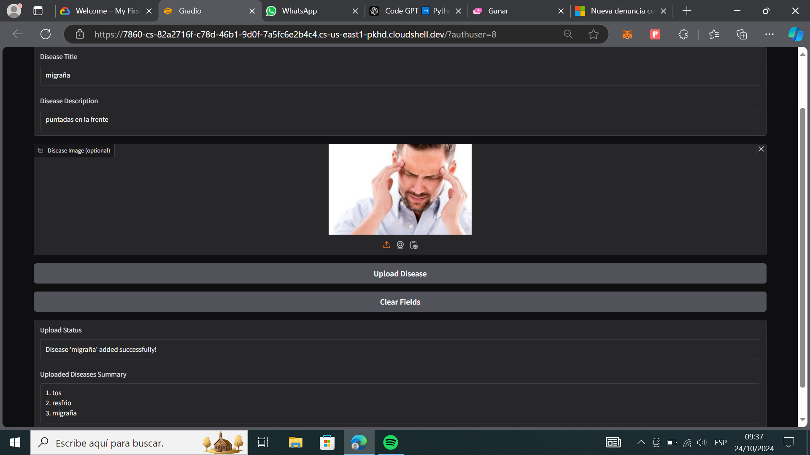
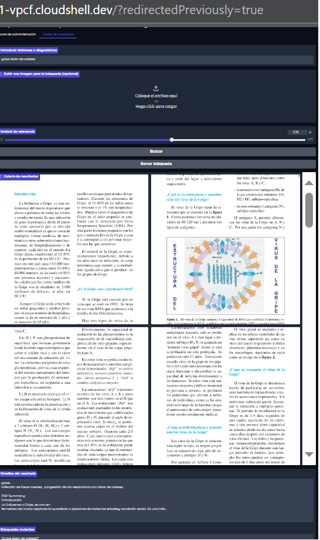

### Text-to-Image Medical Search App


## **Descripción del Proyecto**

**Text-to-Image Medical Search App** es una aplicación desarrollada para facilitar la búsqueda de información médica utilizando texto, imágenes y documentos PDF. Integra procesamiento de lenguaje natural, reconocimiento de imágenes y comparación de similitudes mediante inteligencia artificial para brindar resultados relevantes basados en descripciones o recursos visuales.

### 🩺 **Características Principales**

- **Subida de datos médicos**: Permite a los administradores cargar enfermedades con descripciones detalladas, imágenes y documentos PDF.
- **Búsqueda avanzada**:
  - Basada en texto (síntomas o diagnósticos).
  - Basada en imágenes relacionadas con enfermedades.
- **Gestión de datos**:
  - Actualización de registros existentes.
  - Resumen de las enfermedades subidas.
- **Interfaz interactiva**: Construida con **Gradio**, presenta paneles de administración y búsqueda intuitivos.


## 🛠 **Requisitos Previos**

Para ejecutar este proyecto necesitas:

- **Python 3.8+**
- Librerías esenciales:
  - `torch`, `transformers`, `chromadb`, `gradio`, `Pillow`
  - Herramientas adicionales: `PyPDF2`, `fitz`, `scikit-learn`, `openai`
- Credenciales de OpenAI (opcional).
- Google Cloud o un entorno local con acceso a terminal.

---

## ⚙️ **Instalación**

1. Clona el repositorio:
   ```bash
   git clone https://github.com/tu-repositorio.git
   cd tu-repositorio
   ```

2. Instala las dependencias necesarias:
   ```bash
   pip install -r requirements.txt
   ```

3. Configura la clave de OpenAI (opcional):
   - Crea un archivo `.env`:
     ```env
     OPENAI_API_KEY=tu_clave_openai
     ```

4. Lanza la aplicación:
   ```bash
   python app.py
   ```

---

## 🖼 **Interfaz del Usuario**

La aplicación tiene dos paneles principales:

### 1. **Panel de Administración**
Permite a los administradores cargar información médica:
- **Título**: Nombre de la enfermedad.
- **Descripción**: Información detallada.
- **Imágenes**: Archivos visuales relacionados con la enfermedad.
- **PDF**: Documentos médicos adicionales.


### 2. **Panel de Búsqueda**
Ofrece opciones para buscar enfermedades utilizando:
- **Texto**: Síntomas o diagnósticos.
- **Imágenes**: Fotografías relacionadas con síntomas o condiciones.
- **Galería de resultados**: Imágenes y detalles de la enfermedad.




## 🧠 **Tecnologías Utilizadas**

### 🔍 Inteligencia Artificial
- **Modelo CLIP**: Para incrustaciones de texto e imágenes.
- **Cosine Similarity**: Para comparar similitudes entre datos de entrada y la base de datos.

### 📄 Procesamiento de PDF
- **PyPDF2 y PyMuPDF**: Para extraer texto y generar vistas previas de documentos.

### 💾 Almacenamiento
- **ChromaDB**: Para almacenar y consultar incrustaciones de texto e imágenes.


##  **Cómo Funciona**

1. **Subida de datos**:
   - Los datos médicos (texto, imágenes, PDF) se procesan para generar incrustaciones.
   - Las incrustaciones se almacenan en ChromaDB para búsquedas futuras.



2. **Búsqueda**:
   - El usuario introduce un texto o sube una imagen.
   - El sistema compara las incrustaciones del input con las almacenadas.
   - Los resultados relevantes se muestran con un resumen de texto e imágenes asociadas.


3. **Reporte**:
   - El usuario puede observar el reporte de la busqueda.




## **Cómo Desplegar**

### En Google Cloud
1. Configura un entorno de máquina virtual:
   - Crea una instancia con Python preinstalado.
2. Sube los archivos al editor de Google Cloud.
3. Ejecuta la aplicación:
   ```bash
   python app.py
   ```
4. Habilita el acceso externo para compartir la aplicación con otros usuarios.


## **Mejoras Futuras**

- Integración con APIs médicas externas.
- Soporte multilingüe para texto de entrada y documentos.
- Algoritmos avanzados para búsquedas más precisas.

